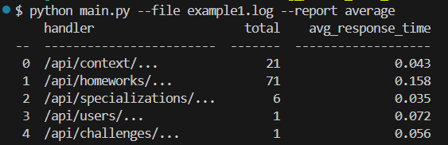
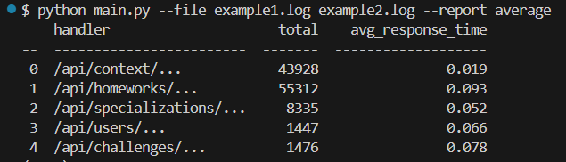
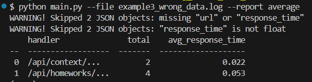
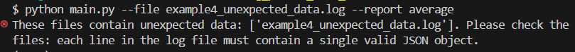
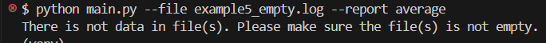

## Скрипт для обработки лог-файла.
Скрипт формирует отчёты на основе логов, представленных в виде JSON-объектов, записанных построчно в файлах. Пользователь через командную строку передаёт пути к одному или нескольким файлам и указывает тип отчёта, а скрипт обрабатывает данные и выводит итоговую таблицу в терминал.

## Стэк проекта:
Python 3.9+, tabulate, pytest (для тестов)

## Локальный запуск скрипта.
1. Создайте виртуальное окружение:
```
# Команда для Windows.
python -m venv venv
# Команда для Linux и macOS.
python3 -m venv venv
```
2. Активируйте виртуальное окружение:
```
# Команда для Windows:
source venv/Scripts/activate
# Для Linux и macOS:
source venv/bin/activate
```
3. Установите зависимости из requirements.txt
```
pip install -r requirements.txt
```
4. Запустите скрипт из командной строки:
```
python main.py --file path/to/file1.log path/to/file2.log --report average
```

## Доступные аргументы:
--file: путь к одному или нескольким файлам с JSON-объектами, записанными построчно.

--report: тип отчета

## Доступные типы отчетов:
average - формирует отчет со списком эндпоинтов, количеством запросов по каждому эндпоинту и средним временем ответа (JSON должен содержать ключи 'url' и 'response_time').

## Примеры запусков:
Запуск с одним файлом: ```python main.py --file log_example_files/example1.log --report average```


Запуск с двумя файлами: ```python main.py --file log_example_files/example1.log log_example_files/example2.log --report average```


Запуск с файлом, где в некоторых JSON отсутствуют нужные ключи, либо неверный тип: ```python main.py --file log_example_files/example3_wrong_data.log --report average```


Запуск с файлом, в котором не JSON-объекты: ```python main.py --file log_example_files/example4_unexpected_data.log --report average```


Запуск с пустым файлом: ```python main.py --file log_example_files/example5_empty.log --report average```


## Тестирование:
Скрипт покрыт юнит-тестами на pytest.
Для запуска тестов выполните команду:
```
pytest
```

## Автор проекта:
[Дуплинская Татьяна](https://github.com/tatiana-dup)